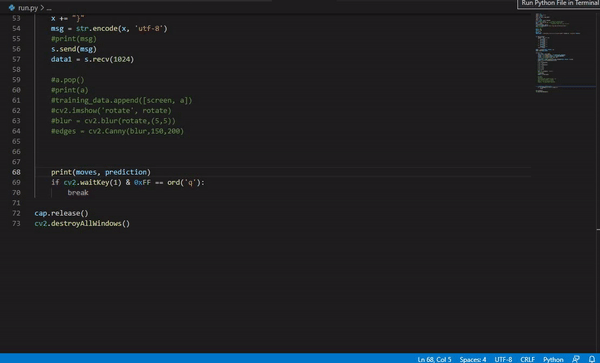

#New
Added pid functionality to remove erratic movements of steering servo. Change PID values to suit your car.


<!-- PROJECT LOGO -->
<br />
<p align="center">
  <h2 align="center">Autonomous car</h2>

  <p align="center">
    A very accessible project on autonomous cars using ML
    <br />
    
  </p>
</p>


<!-- TABLE OF CONTENTS -->
<details open="open">
  <summary>Table of Contents</summary>
  <ol>
    <li>
      <a href="#about-the-project">About The Project</a>
      <ul>
        <li><a href="#built-with">Built With</a></li>
      </ul>
    </li>
    <li>
      <a href="#getting-started">Getting Started</a>
      <ul>
        <li><a href="#prerequisites">Prerequisites</a></li>
        <li><a href="#assembling-the-car">Assembling the car</a></li>
        <li><a href="#installation">Installation</a></li>
        <li><a href="#training">Training</a></li>
      </ul>
    </li>
    <li><a href="#contributing">Contributing</a></li>
    <li><a href="#contact">Contact</a></li>
    <li><a href="#acknowledgements">References</a></li>
  </ol>
</details>


<!-- ABOUT THE PROJECT -->
## About The Project

![Product Name Screen Shot][product-screenshot]

There are many autonomous car projects on GitHub, however, many of those require costly hardware or it is just a simulation. I want everyone who is interested in AI, ML and autonomous vehicles to have hands on approach on building, training and deploying a autonomous vehicle.

Key Features:
* This porject uses very cheap off the shelf items to build your own autonomous car.
* Easy to understand and train your own AI models.

Of course there are plug and play systems which you can buy, But those are very costly or you need a CS degree from MIT to understand the documentation, which can be little intimidating for bigginers. I was one of those guys. So here's my Project. Thanks to all the people who have contributed to expanding this project and thanks for using it. 

A list of commonly used resources that I find helpful are listed in the acknowledgements.

### Built With

* [MicroPython](https://micropython.org/)
* [python](https://www.python.org/)
* [Arduino](https://www.arduino.cc/)
* [alexnet](https://github.com/tflearn/tflearn/blob/master/examples/images/alexnet.py)


<!-- GETTING STARTED -->
## Getting Started

We will start with things required to build your car and how to setup the project locally on your device.

### Prerequisites
* Knowledge on how to work with MicroPython on ESP32 or any other Micropython compitable development board.
* Comfortable with soldering on PCB board.
* Basic knowledge in arduino programming.
* Basic knowledge in python programming.

<!-- ASSEMBLING THE CAR -->
### Assembling the car
Follow this [link](https://github.com/rakesh-i/ESP32-RC-car/tree/main) on how to assemble a car for this project.

### Installation

1. Clone the repo
   ```sh
   git clone https://github.com/rakesh-i/Autonomous-car
   ```
2. Install MicroPyhon on ESP32
   
    Follow this [link](https://randomnerdtutorials.com/flashing-micropython-firmware-esptool-py-esp32-esp8266/) to flash MicroPython on ESP32.
3. Copying files to ESP32
    
    * Connect ESP32 to yoru PC, check on which com port esp32 is connected by going to device manager in Windows.. Open CMD terminal in ESP32 folder, which is in downloaded repo. Execute the followng command to connect to esp32.(repalce X with port number eg: COM5, COM9) 
        ```sh
        rshell --port COMX
        ``` 
    * Copy files to esp32 one by one.
    (Remember to go through server.py and web.py to add wifi credentials and ip addresses. And PLEASE READ "wireless-setup.txt" how to do so. )
        ```sh
        cp boot.py /pyboard
        cp main.py /pyboard
        cp motor.py /pyboard
        cp server.py /pyboard
        cp web.py /pyboard
        ```
    * If you done every thing right till now, when you press EN button on esp32, you should see onboard led of esp32 lightup for 5 seconds notifying it is connected to the wifi.
    * You can type 
        ```sh
        repl
        ```
        to open esp32 serial monitor. If you see connection successful message then you are good-to-go.
    * Now esp32 is wating for connection from client. Run client.py, which is in Client folder. If you see "Got connection from: 111.111.111.111, 11111" message then you have successfully established a tcp connection between your PC and ESP32.
4. Setting up  ESP32 CAM
    * Follow this [link](https://robotzero.one/esp32-cam-arduino-ide/) to setup esp32-cam.
    
      


<!-- TRAINING -->
## Training
### Before you start, I would recommend you to watch [this](https://www.youtube.com/playlist?list=PLQVvvaa0QuDeETZEOy4VdocT7TOjfSA8a) playlist on autonomous vehicles in GTA V game by [Sentdex](https://www.youtube.com/channel/UCfzlCWGWYyIQ0aLC5w48gBQ)
1. Open Training folder from repo.
2. Turn on the car and put it on the track you have prepared.
3. Wait for onboard led of esp32 to turn off.
4. Check ESP32 CAM ip on network. Update the ip in VideoCapture(JUST THE IP DO NOT CHANGE ANYTHING!!! LEAVE `:81/stream` AS IT IS!! )  
4. Start stream.py and start driving the car on the track. reduce the speed of car for greater control. `Change values in motor.motorSpeed(x).(Max = 1000, min = 0)` 
5. Quit by pressing q when you are satisfied with your training or delete the "train_data.npy" and start again. I recommend around 20000 frames for your first model. You can see how many frames are recorded on terminal. 
6. Now  we need to balance our data. Run balance.py. It will create a file "balanced.npy" with balanced data.
7. Reviewing training data. 
   
   
8. Now time to train our AI model. You can change prameters which suits your requirements. But I recommend to leave as it is for beginners. Run train_model.py. It will create your model based on your trainning data. Ihave trained mine on 2000 data points after balancing the data.

## Testing 
If you have done everything  right upto this point your autonomous car is ready for its first autonomous steps. 
* If you are running a good system you can turn up the speed of the car. Otherwise reduce the speed of car, so your system has time to process the data and produce predictions.
* Turn on your car and put it on the track.
* When car is ready to go, run "run.py". 

Thats it, now your car should follow the track autonomously.
  
  
  


<!-- CONTRIBUTING -->
## Contributing

Contributions are what make the open source community such an amazing place to be learn, inspire, and create. Any contributions you make are **greatly appreciated**.


<!-- CONTACT -->
## Contact

Rakesh Chavan - [@rakesh_.chavan](https://www.instagram.com/rakesh_.chavan/) - rakesh.007ac@gmail.com

Project Link: [https://github.com/rakesh-i/Autonomous-car/](https://github.com/rakesh-i/Autonomous-car/)


<!-- ACKNOWLEDGEMENTS -->
## References
* [Sentdex GTA V autonomous vehicles](https://github.com/Sentdex/pygta5)
* [MicroPython](https://micropython.org/)
* [Arduino](https://www.arduino.cc/)
* [Clayton Darwin](https://www.youtube.com/channel/UC71gzWGsJ4ezSkm-Fnn9RHw)
* [alexnet](https://github.com/tflearn/tflearn/blob/master/examples/images/alexnet.py)


<!-- MARKDOWN LINKS & IMAGES -->
<!-- https://www.markdownguide.org/basic-syntax/#reference-style-links -->
[product-screenshot]: media/img.jpg
